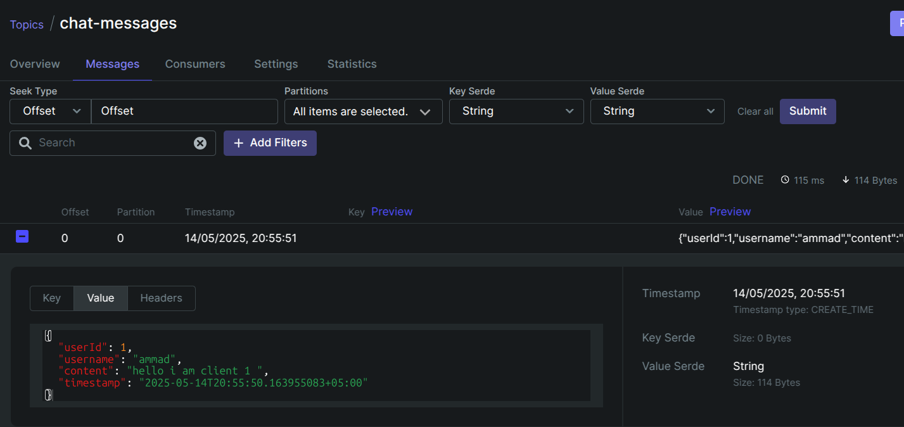

# Go Microservices Project

This project consists of three microservices: `auth-service`, `ws-service`, and `persistence-service`. These services communicate with each other using Kafka and a PostgreSQL database.

## Prerequisites

Before running the services, ensure you have the following installed:

- [Docker](https://www.docker.com/)
- [Docker Compose](https://docs.docker.com/compose/)
- [Kubernetes](https://kubernetes.io/) (if using manifests)
- [kubectl](https://kubernetes.io/docs/tasks/tools/)
- [Minikube](https://minikube.sigs.k8s.io/docs/start/) or any Kubernetes cluster (if using manifests)
- [Go](https://golang.org/) (if running locally)

---

## Running Services Without Manifests

### 1. Start Dependencies Using Docker Compose

Run the following command to start Kafka, Zookeeper, and Kafka UI:

```bash
docker-compose up -d
```

### 2. Run `auth-service`

1. Navigate to the `auth-service` directory:
   ```bash
   cd auth-service
   ```

2. Build the service:
   ```bash
   go build -o main ./cmd/main.go
   ```

3. Create a `.env` file based on `.env.example` and configure the environment variables.

4. Run the service:
   ```bash
   ./main
   ```

The service will be available at `http://localhost:8000`.

---

### 3. Run `ws-service`

1. Navigate to the `ws-service` directory:
   ```bash
   cd ws-service
   ```

2. Build the service:
   ```bash
   go build -o main ./cmd/main.go
   ```

3. Create a `.env` file based on `.env.example` and configure the environment variables.

4. Run the service:
   ```bash
   ./main
   ```

The service will be available at `http://localhost:8001`.

---

### 4. Run `persistence-service`

1. Navigate to the `persistence-service` directory:
   ```bash
   cd persistence-service
   ```

2. Build the service:
   ```bash
   go build -o main ./cmd/main.go
   ```

3. Create a `.env` file based on `.env.example` and configure the environment variables.

4. Run the service:
   ```bash
   ./main
   ```

---

## Running Services With Kubernetes Manifests

### 1. Start Minikube or Kubernetes Cluster

Start your Kubernetes cluster using Minikube or any other Kubernetes provider:

```bash
minikube start
```

### 2. Deploy Kafka and Zookeeper

Apply the Kafka manifests:

```bash
kubectl apply -f kafka-k8s.yaml
```

### 3. Deploy PostgreSQL

Apply the PostgreSQL manifests:

```bash
kubectl apply -f postgres-configmap.yaml
kubectl apply -f postgres-pv-pvc.yaml
kubectl apply -f postgres-deployment.yaml
kubectl apply -f postgres-service.yaml
```

### 4. Deploy `auth-service`

Apply the `auth-service` manifests:

```bash
kubectl apply -f auth-k8s.yaml
```

The service will be available at the Kubernetes cluster's IP and port `8000`.

---

### 5. Deploy `ws-service`

Apply the `ws-service` manifests:

```bash
kubectl apply -f ws-k8s.yaml
```

The service will be available at the Kubernetes cluster's IP and port `8001`.

---

### 6. Deploy `persistence-service`

Apply the `persistence-service` manifests:

```bash
kubectl apply -f persistence-k8s.yaml
```

---

## Verifying the Setup

1. Use `kubectl get pods` to ensure all pods are running.
2. Use `kubectl get services` to get the cluster IPs and ports for each service.
3. Test the services using tools like `curl` or Postman.

---

## Notes

- Ensure the `.env` files are properly configured for each service.
- Kafka topics are automatically created as per the configuration.
- Use Kafka UI (available at `http://localhost:8080`) to monitor Kafka topics and messages.


### 2. Run `auth-service`

1. Navigate to the `auth-service` directory:
   ```bash
   cd auth-service
   ```

2. Build the service:
   ```bash
   go build -o main ./cmd/main.go
   ```

3. Create a `.env` file based on `.env.example` and configure the environment variables.

4. Run the service:
   ```bash
   ./main
   ```

The service will be available at `http://localhost:8000`.

---

### 3. Run `ws-service`

1. Navigate to the `ws-service` directory:
   ```bash
   cd ws-service
   ```

2. Build the service:
   ```bash
   go build -o main ./cmd/main.go
   ```

3. Create a `.env` file based on `.env.example` and configure the environment variables.

4. Run the service:
   ```bash
   ./main
   ```

The service will be available at `http://localhost:8001`.

---

### 4. Run `persistence-service`

1. Navigate to the `persistence-service` directory:
   ```bash
   cd persistence-service
   ```

2. Build the service:
   ```bash
   go build -o main ./cmd/main.go
   ```

3. Create a `.env` file based on `.env.example` and configure the environment variables.

4. Run the service:
   ```bash
   ./main
   ```

---

## Running Services With Kubernetes Manifests

### 1. Start Minikube or Kubernetes Cluster

Start your Kubernetes cluster using Minikube or any other Kubernetes provider:

```bash
minikube start
```

### 2. Deploy Kafka and Zookeeper

Apply the Kafka manifests:

```bash
kubectl apply -f kafka-k8s.yaml
```

### 3. Deploy PostgreSQL

Apply the PostgreSQL manifests:

```bash
kubectl apply -f postgres-configmap.yaml
kubectl apply -f postgres-pv-pvc.yaml
kubectl apply -f postgres-deployment.yaml
kubectl apply -f postgres-service.yaml
```

### 4. Deploy `auth-service`

Apply the `auth-service` manifests:

```bash
kubectl apply -f auth-k8s.yaml
```

The service will be available at the Kubernetes cluster's IP and port `8000`.

---

### 5. Deploy `ws-service`

Apply the `ws-service` manifests:

```bash
kubectl apply -f ws-k8s.yaml
```

The service will be available at the Kubernetes cluster's IP and port `8001`.

---

### 6. Deploy `persistence-service`

Apply the `persistence-service` manifests:

```bash
kubectl apply -f persistence-k8s.yaml
```

---

## Running Unit Tests

### `auth-service`

1. Navigate to the `auth-service` directory:
   ```bash
   cd auth-service
   ```

2. Run the tests:
   ```bash
   go test ./tests/... -v
   ```

---

## Testing APIs with `curl`

### `auth-service`

1. **Register a User**:
   ```bash
   curl -X POST http://localhost:8000/auth/register \
   -H "Content-Type: application/json" \
   -d '{"username": "testuser", "email": "test@example.com", "password": "securepass"}'
   ```

2. **Login**:
   ```bash
   curl -X POST http://localhost:8000/auth/login \
   -H "Content-Type: application/json" \
   -d '{"email": "test@example.com", "password": "securepass"}'
   ```

3. **Get User Info**:
   Replace `<TOKEN>` with the token received from the login response.
   ```bash
   curl -X GET http://localhost:8000/auth/me \
   -H "Authorization: Bearer <TOKEN>"
   ```

---

### `ws-service`

1. **Connect to WebSocket**:
   Replace `<TOKEN>` with the token received from the `auth-service` login response.
   ```bash
   curl -i -N -H "Connection: Upgrade" -H "Upgrade: websocket" \
   -H "Authorization: Bearer <TOKEN>" \
   http://localhost:8001/ws
   ```

---

### `persistence-service`

The `persistence-service` does not expose HTTP endpoints but listens to Kafka messages and stores them in the database. You can verify its functionality by checking the database for stored messages.

---

## Notes

- Ensure the `.env` files are properly configured for each service.
- Kafka topics are automatically created as per the configuration.
- Use Kafka UI (available at `http://localhost:8080`) to monitor Kafka topics and messages.


### 2. Run `auth-service`

1. Navigate to the `auth-service` directory:
   ```bash
   cd auth-service
   ```

2. Build the service:
   ```bash
   go build -o main ./cmd/main.go
   ```

3. Create a `.env` file based on `.env.example` and configure the environment variables.

4. Run the service:
   ```bash
   ./main
   ```

The service will be available at `http://localhost:8000`.

---

### 3. Run `ws-service`

1. Navigate to the `ws-service` directory:
   ```bash
   cd ws-service
   ```

2. Build the service:
   ```bash
   go build -o main ./cmd/main.go
   ```

3. Create a `.env` file based on `.env.example` and configure the environment variables.

4. Run the service:
   ```bash
   ./main
   ```

The service will be available at `http://localhost:8001`.

---

### 4. Run `persistence-service`

1. Navigate to the `persistence-service` directory:
   ```bash
   cd persistence-service
   ```

2. Build the service:
   ```bash
   go build -o main ./cmd/main.go
   ```

3. Create a `.env` file based on `.env.example` and configure the environment variables.

4. Run the service:
   ```bash
   ./main
   ```

---

## Running Services With Kubernetes Manifests

### 1. Start Minikube or Kubernetes Cluster

Start your Kubernetes cluster using Minikube or any other Kubernetes provider:

```bash
minikube start
```

### 2. Deploy Kafka and Zookeeper

Apply the Kafka manifests:

```bash
kubectl apply -f kafka-k8s.yaml
```

### 3. Deploy PostgreSQL

Apply the PostgreSQL manifests:

```bash
kubectl apply -f postgres-configmap.yaml
kubectl apply -f postgres-pv-pvc.yaml
kubectl apply -f postgres-deployment.yaml
kubectl apply -f postgres-service.yaml
```

### 4. Deploy `auth-service`

Apply the `auth-service` manifests:

```bash
kubectl apply -f auth-k8s.yaml
```

The service will be available at the Kubernetes cluster's IP and port `8000`.

---

### 5. Deploy `ws-service`

Apply the `ws-service` manifests:

```bash
kubectl apply -f ws-k8s.yaml
```

The service will be available at the Kubernetes cluster's IP and port `8001`.

---

### 6. Deploy `persistence-service`

Apply the `persistence-service` manifests:

```bash
kubectl apply -f persistence-k8s.yaml
```

---

## Running Unit Tests

### `auth-service`

1. Navigate to the `auth-service` directory:
   ```bash
   cd auth-service
   ```

2. Run the tests:
   ```bash
   go test ./tests/... -v
   ```

---

## Testing APIs with `curl`

### `auth-service`

1. **Register a User**:
   ```bash
   curl -X POST http://localhost:8000/auth/register \
   -H "Content-Type: application/json" \
   -d '{"username": "testuser", "email": "test@example.com", "password": "securepass"}'
   ```

2. **Login**:
   ```bash
   curl -X POST http://localhost:8000/auth/login \
   -H "Content-Type: application/json" \
   -d '{"email": "test@example.com", "password": "securepass"}'
   ```

3. **Get User Info**:
   Replace `<TOKEN>` with the token received from the login response.
   ```bash
   curl -X GET http://localhost:8000/auth \
   -H "Authorization: Bearer <TOKEN>"
   ```

---

### `ws-service`

1. **Connect to WebSocket**:
   Replace `<TOKEN>` with the token received from the `auth-service` login response.
   ```bash
   curl -i -N -H "Connection: Upgrade" -H "Upgrade: websocket" \
   "ws://localhost:8001/ws?token=<TOKEN>"
   ```
---

### persistence-service

The persistence-service does not expose HTTP endpoints but listens to Kafka messages and stores them in the database. You can verify its functionality by checking the database for stored messages.

---

## Notes

- Ensure the `.env` files are properly configured for each service.
- Kafka topics are automatically created as per the configuration.
- Use Kafka UI (available at `http://localhost:8080`) to monitor Kafka topics and messages.
```

This includes the correct `curl` command for the `ws-service` using the WebSocket URL with a token query parameter.This includes the correct `curl` command for the `ws-service` using the WebSocket URL with a token query parameter.

```
## Output



```
